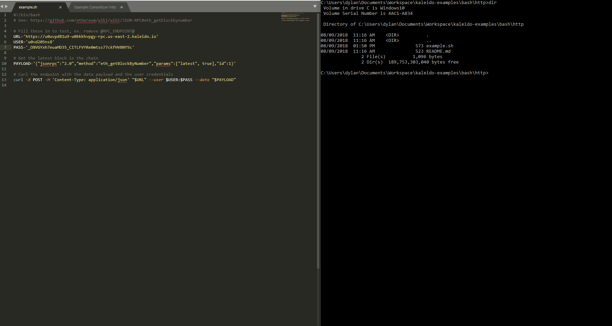

# Example bash script with embedded JSON/RPC call

A simple bash script using the raw JSON/RPC API to connect to a Kaleido node and retrieve the latest block number on the chain.

## Steps
1. In http/example.sh:
   + Replace the `@RPC_ENDPOINT@` placeholder with the RPC endpoint for your node.
   + Replace the `@USER@` placeholder with the basic auth credentials username.
   + Replace the `@PASS` placeholder with the basic auth credentials password.
2. Save the file and run `./example.sh` to drive the call.

## Walkthrough GIF

