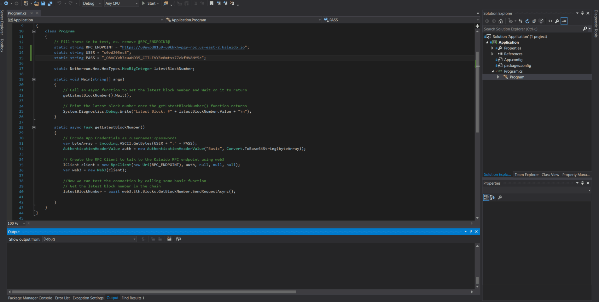

# Nethereum Example Application
An example application on Kaleido using Nethereum. This demonstrates how to connect to a Kaleido node using basic auth and retrieve the latest block number on the chain.

## Requirements

1. A .NET-compatible IDE (e.g. [Visual Studio](https://visualstudio.microsoft.com/downloads/))

## Steps
1. Using Visual Studio or another .NET-compatible IDE, open the `Application.sln` file in the nethereum/quorum subdirectory of this project.
1. In Application/Program.cs
    + Replace the `@RPC_ENDPOINT@` placeholder with the RPC endpoint for your node.
    + Replace the `@USER@` placeholder with the basic auth credentials username.
    + Replace the `@PASS` placeholder with the basic auth credentials password.
2. Run the program in Debug mode and open the application output window to see the latest block number.  If you do NOT run in Debug mode, the program will be unable to print output.  

## Walkthrough GIF

NOTE: This gif shows the geth example; however, the steps and output are the same.
