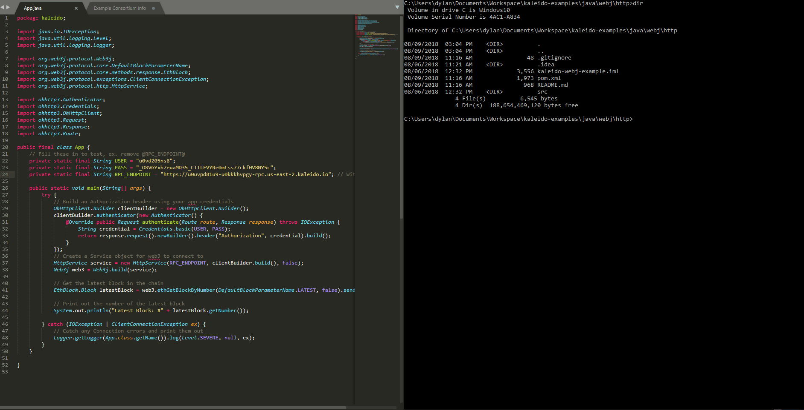

# WebJ Example Application
An example application on Kaleido using the web3 Java library. This demonstrates how to connect to a Kaleido node using basic auth and retrieve the latest block number on the chain.

## Requirements

1. Java 1.8+
2. Maven

## Steps
1. In src/main/java/kaleido/App.java:
    + Replace the `@RPC_ENDPOINT@` placeholder with the RPC endpoint for your node.
    + Replace the `@USER@` placeholder with the basic auth credentials username.
    + Replace the `@PASS` placeholder with the basic auth credentials password.
2. Navigate to the java/webj/http/ subdirectory and run `mvn package` to install the dependencies and build the Java archive file.  This will output a JAR file - `kaleido-webj-example-0.0.1-SNAPSHOT-jar-with-dependencies.jar` - into a newly created /target directory.
3. Remain in java/webj/http/ and run `java -jar target/kaleido-webj-example-0.0.1-SNAPSHOT-jar-with-dependencies.jar` to kick off the program.

## Walkthrough GIF

<a href="https://raw.githubusercontent.com/kaleido-io/kaleido-examples/master/java/webj/WebjExample.gif">Open GIF</a>
