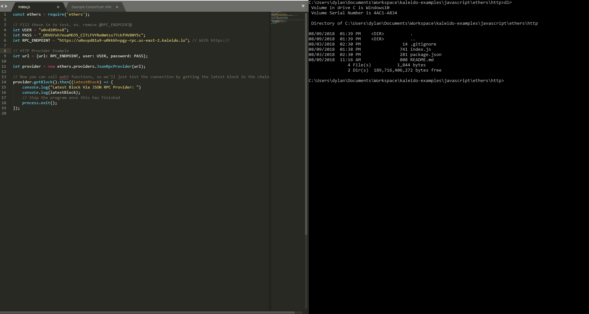

# Ethers.js - HTTP Provider Example

An example script on Kaleido using [Ethers.js](https://github.com/ethers-io/ethers.js "Ethers.js Github"). This demonstrates how to connect to a Kaleido node using basic auth via HTTP and retrieve the latest block on the chain.

## Requirements
1. [Node & NPM](https://nodejs.org/en/)

## Steps
1. In ethers/http/index.js:
    + Replace the `@RPC_ENDPOINT@` placeholder with the RPC endpoint for your node.
    + Replace the `@USER@` placeholder with the basic auth credentials username.
    + Replace the `@PASS@` placeholder with the basic auth credentials password.
2. Save the file and from the ethers/http subdirectory run `npm install` to install the node modules for the project.
3. From the same directory, run `node index.js` to drive the program.

## Walkthrough GIF

<a href="https://raw.githubusercontent.com/kaleido-io/kaleido-examples/master/javascript/ethers/http/EthersjsExample.gif">Open GIF</a>