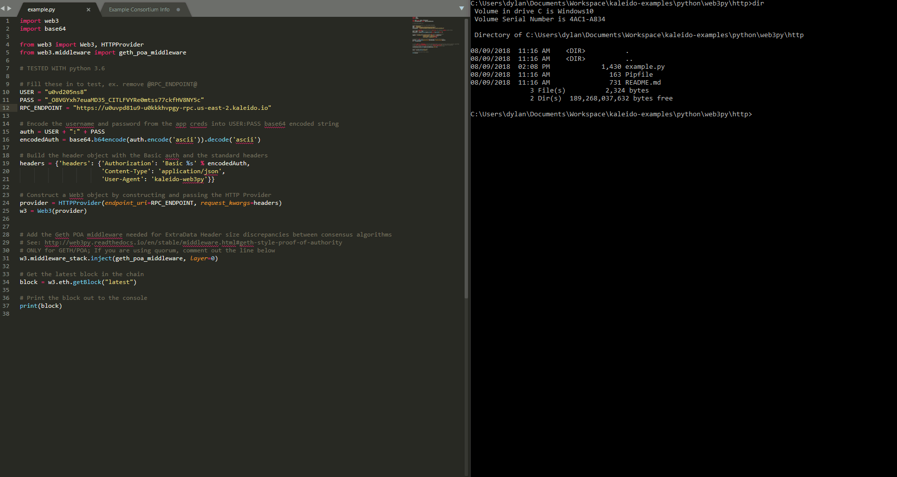

# Web3py Example Application
An example application on Kaleido using the web3 python library. This demonstrates how to connect to a Kaleido node using basic auth via Websocket and retrieve the latest block number on the chain.

## Requirements

1. Python 2.7+

## Steps
1. In web3py/wss/example.py:
    + Replace the `@WSS_ENDPOINT@` placeholder with the WSS endpoint for your node.
    + Replace the `@USER@` placeholder with the basic auth credentials username.
    + Replace the `@PASS` placeholder with the basic auth credentials password.
2. Save the file, and from the web3py/wss/ subdirectory run `pipenv install --skip-lock` to install the project dependencies.
3. Run `pipenv shell` to activate the virtual environment
4. Run `python example.py` to drive the program.

## Walkthrough GIF

NOTE: This gif shows the http example; however, the steps and output are the same.
